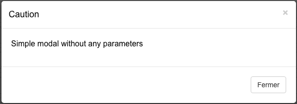
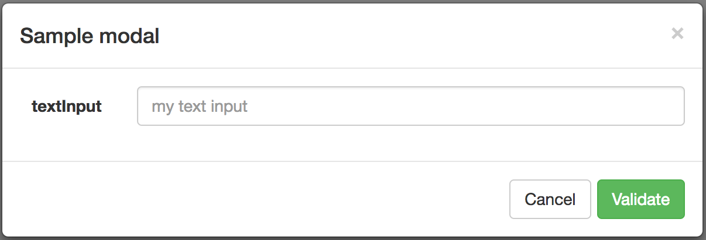
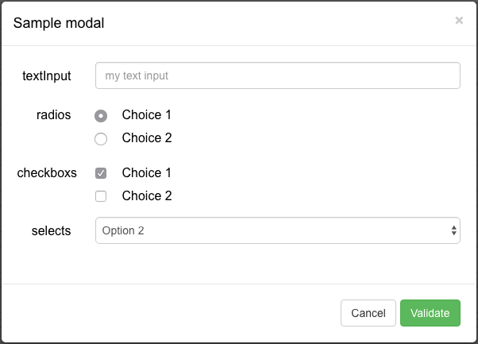

# ExtendedBootstrapModal

## Overview
Extended Bootstrap Modal is a **simple** Javascript plugin enables you to generate a complex bootstrap modal **without any HTML code**.

## Requirements
* Jquery 1.10 or higher.

## Installation
```
<!-- Import Jquery -->
<script
  src="https://code.jquery.com/jquery-1.12.4.min.js"
  integrity="sha256-ZosEbRLbNQzLpnKIkEdrPv7lOy9C27hHQ+Xp8a4MxAQ="
  crossorigin="anonymous"></script>

<!-- Import Bootstrap -->
<script src="https://maxcdn.bootstrapcdn.com/bootstrap/3.3.7/js/bootstrap.min.js" integrity="sha384-Tc5IQib027qvyjSMfHjOMaLkfuWVxZxUPnCJA7l2mCWNIpG9mGCD8wGNIcPD7Txa" crossorigin="anonymous"></script>
<link href="https://maxcdn.bootstrapcdn.com/bootstrap/3.3.7/css/bootstrap.min.css" rel="stylesheet" integrity="sha384-BVYiiSIFeK1dGmJRAkycuHAHRg32OmUcww7on3RYdg4Va+PmSTsz/K68vbdEjh4u" crossorigin="anonymous">

<!-- Import Extended bootstrap modal plugin -->
<script src="plugin/extendedBootstrapModal.js"></script>
```

## How to use it

### Simple modal

You can simply use the plugin without any parameters, it will generate a simple and classic bootstrap modal with the given text, and a close button.

This is an elegant way to replace the old Javascript Alert, and this is as simple as it.

#### Sample
```
ExtendedBoostrapModal('Simple modal without any parameters');
```


### Modal state
You can specify a modal state to change the header color :

* success
* warning
* danger
* info
* primary


### Complex modal
The plugin become a powerfull tools when you want to generate complex modal with many HTML components.

* No HTML code
* Many modals on the same page without duplicate code
* Possibility to to add a form with inputs, radio button, checkbox and dropdown list
* Add Bootstrap row with many columns
* Easily customizable

#### Autoload modal with text

```
ExtendedBoostrapModal({
    autoload: true,
    id: 'my-modal',
    title: 'Sample modal'
});
```

#### Modal with simple form
You can add an HTML form by using **addForm** parameter with id, name, and a list of HTML tags.
If you use it, you have to manually define a collection of buttons (at least one for closing).

You can define a callback on each button by using **callback** parameter, and add parameters with **arguments**.

```
ExtendedBoostrapModal({
    autoload: true,
    id: 'my-modal',
    title: 'Sample modal',
    addForm: {
        id: 'form_id',
        name: 'form_name',
        inputs: {
            label: 'textInput',
            list: [
                {
                    id: 'input_id',
                    name: 'input_name',
                    type: 'text',
                    value: '',
                    placeholder: 'my text input'
                }
            ]
        },
        buttons: [
            {
                value: 'Cancel',
                type: 'button'
            },
            {
                name: 'btn_add',
                value: 'Validate',
                type : 'button',
                class: 'btn-success',
                callback: 'my_callback_fct',
                arguments : ['arg1', 'arg2']
            }
        ]
    }
});

function my_callback_fct(arg1, arg2)
{
}
```


#### Modal with complex form

You can add the following components :

* Input text (with or without pattern)
* Radio button
* Checkbox
* Select

Each component works the same way : you just have to **add a node with a name and a tags list**.

##### Input text
```
inputs: {
    label: 'input1',
    list: [
        {
            id: 'input_id1',
            name: 'input_name1',
            type: 'text',
            value: '',
            placeholder: 'my first text input'
        },
        {
            id: 'input_id2',
            name: 'input_name2',
            type: 'text',
            value: '',
            placeholder: 'my second text input with pattern',
            pattern: '.{5,}' // Pattern example, contain 5 or more characters
        }
    ]
}
```

##### Radio button
/!\ You have to use the same name for each radio if you want to linked them

```
radios : {
	label : 'radios',
	list: [
	    {
	        name: 'radio_name',
	        value: 'choice_1',
	        content: 'Choice 1',
	        checked: true
	    },
	    {
	        name: 'radio_name',
	        value: 'choice_2',
	        content: 'Choice 2'
	    }
	]
}
```

##### Checkbox

```
checkboxs : {
    label : 'checkboxs',
    list: [
        {
            name: 'check1',
            content: 'Choice 1'
        },
        {
            name: 'check2',
            content: 'Choice 2'
        }
    ]
}
```

##### Select

```
selects: {
    label : 'selects',
    list : [
        {
            name:"myList",
            options : [
                {
                    name: 'opt1',
                    value: 'Option 1'
                },
                {
                    name: 'opt2',
                    value: 'Option 2',
                    selected: true
                },
            ],
        }
    ]
}
```

## Complete sample
Here is a complete sample you can use to **build your proper modal**.

```
ExtendedBoostrapModal({
    autoload: true,
    id: 'my-modal',
    title: 'Sample modal',
    addForm: {
        id: 'form_id',
        name: 'form_name',
        inputs: {
            label: 'textInput',
            list: [
                {
                    id: 'input_id',
                    name: 'input_name',
                    type: 'text',
                    value: '',
                    placeholder: 'my text input'
                }
            ]
        },
        buttons: [
                {
                    value: 'Cancel',
                    type: 'button'
                },
                {
                    name: 'btn_add',
                    value: 'Validate',
                    type : 'button',
                    class: 'btn-success',
                    callback: 'my_callback_fct',
                    arguments : ['arg1', 'arg2']
                }
        ],
        radios : {
            label : 'radios',
            list: [
                {
                    name: 'radio_name',
                    value: 'choice_1',
                    content: 'Choice 1'
                },
                {
                    name: 'radio_name',
                    value: 'choice_2',
                    content: 'Choice 2'
                }
            ]
        },
        checkboxs : {
            label : 'checkboxs',
            list: [
                {
                    name: 'check1',
                    content: 'Choice 1'
                },
                {
                    name: 'check2',
                    content: 'Choice 2'
                }
            ]
        },
        selects: {
            label : 'selects',
            list : [
                {
                    name:"myList",
                    options : [
                        {
                            name: 'opt1',
                            value: 'Option 1'
                        },
                        {
                            name: 'opt2',
                            value: 'Option 2',
                            selected: true
                        },
                    ],
                }
            ]
        }
    }
});
```

